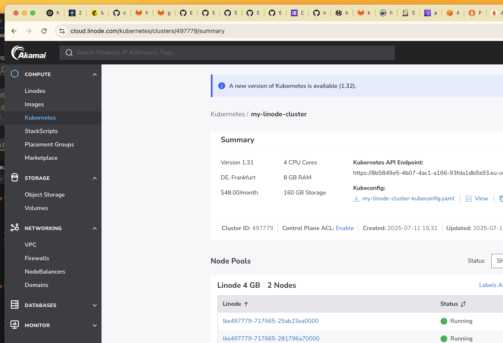
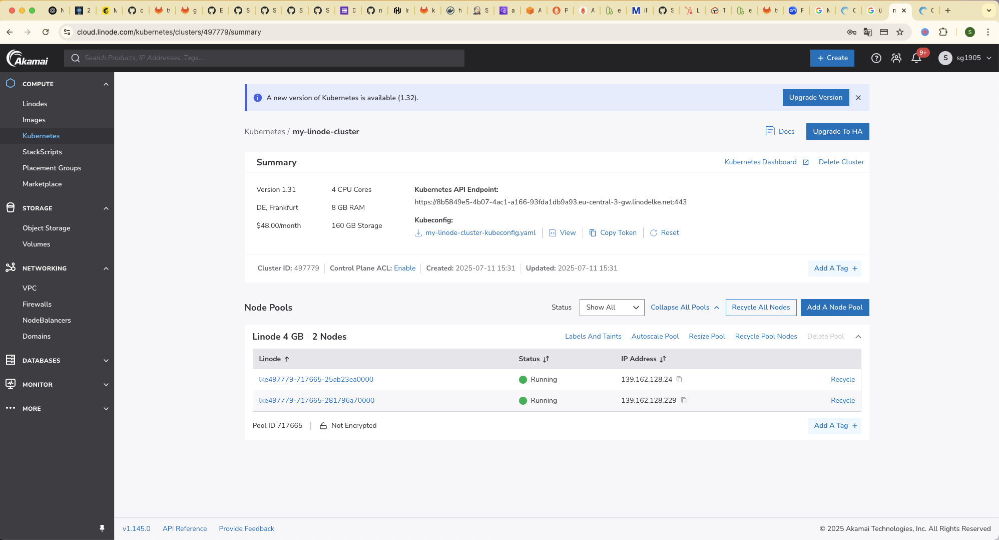
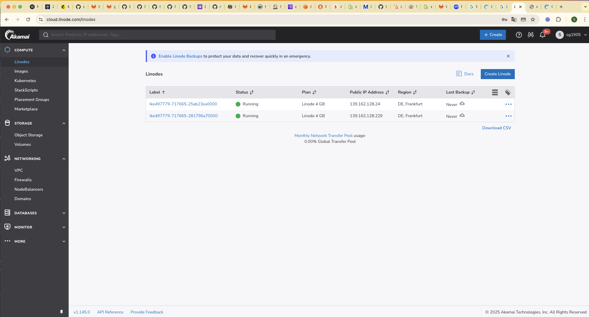

# CAPSTONE PROJECT 4

## Step 1: Installing Linode CLI

First, I installed the Linode CLI using Homebrew:

```sh
brew install linode-cli
```

> ✅ Homebrew auto-updated. Linode CLI was installed successfully.

---

## Step 2: Configuring Linode CLI

Next, I configured the Linode CLI to authenticate and use my account:

```sh
linode-cli configure
```

You’ll be prompted to enter your personal access token and default settings like region and output format.

---

## Step 3: Creating a Kubernetes Cluster on Linode

Initially, I attempted to create a cluster using Kubernetes version `1.28`, which failed:

```sh
linode-cli lke cluster-create \
  --label my-linode-cluster \
  --region eu-west \
  --k8s_version 1.28 \
  --node_pools.type g6-standard-2 \
  --node_pools.count 2
```

**Error:**

```
Request failed: 400
errors                                    
┌─────────────┬──────────────────────────┐
│ field       │ reason                   │
├─────────────┼──────────────────────────┤
│ k8s_version │ k8s_version is not valid │
└─────────────┴──────────────────────────┘
```

To fix this, I listed the available Kubernetes versions:

```sh
linode-cli lke versions-list
```

**Available versions:**

```
1.33
1.32
1.31
```

Then I successfully created the cluster with version `1.31` in the `eu-central` region:

```sh
linode-cli lke cluster-create \
  --label my-linode-cluster \
  --region eu-central \
  --k8s_version 1.31 \
  --node_pools.type g6-standard-2 \
  --node_pools.count 2
```

**Output:**

```
┌────────┬───────────────────┬────────────┬─────────────┬─────────────────────────────────┬──────┐
│ id     │ label             │ region     │ k8s_version │ control_plane.high_availability │ tier │
├────────┼───────────────────┼────────────┼─────────────┼─────────────────────────────────┼──────┤
│ 497779 │ my-linode-cluster │ eu-central │ 1.31        │ False                           │      │
└────────┴───────────────────┴────────────┴─────────────┴─────────────────────────────────┴──────┘
```



---

## Step 4: Connecting to the Cluster

I exported the Kubeconfig to interact with the cluster via `kubectl`:

```sh
export KUBECONFIG=my-linode-cluster-kubeconfig.yaml
```

After that, I verified the cluster was up and running:

```sh
kubectl get nodes -o wide
```

---

## Step 5: Deploying the Application

I deployed the microservices application (Online Boutique) using a Kubernetes manifest:

```sh
kubectl apply -f linode-boutique/kubernetes-manifests.yaml
```

This created all deployments and services for the microservices shop.

---

## Step 6: Accessing the Shop

I located the external IP from the `frontend-external` service:

```sh
kubectl get svc frontend-external
```

Using the EXTERNAL-IP, I accessed the application in the browser.

---

## Step 7: Cleaning Up

To avoid ongoing charges, I deleted the Linode cluster using the CLI:

```sh
linode-cli lke cluster-delete 497779
```

---

## What Did I Build?

I built a Kubernetes-based microservices application on Linode using:

- **Linode CLI** to provision the cluster
- **kubectl** to manage the deployments
- **YAML manifests** to deploy Google’s Online Boutique
- **LoadBalancer service** to expose the frontend to the internet

---

## What Did I Learn?

- How to use Linode CLI to provision infrastructure
- Working with Kubernetes clusters on Linode
- Deploying and managing microservices with Kubernetes
- Connecting clusters using `kubectl` and Kubeconfig
- How to expose services using a LoadBalancer

---

## Additional Notes

- Region used: `eu-central`
- Kubernetes version: `1.31`
- Node pool: 2 × `g6-standard-2`
- App used: **Online Boutique** (Google Microservices Demo)
